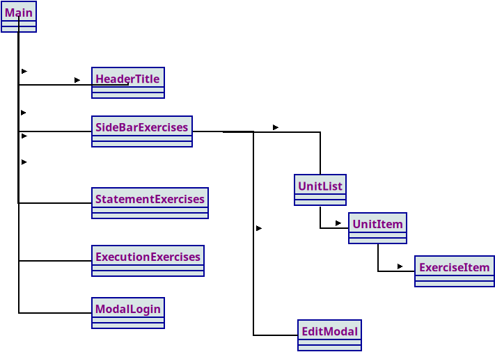

#  Listado de Ejercicios PHP 


Aplicación web creada con **Laravel 12**, **Inertia.js** y **Vue 3** cuyo objetivo es mostrar y gestionar un conjunto de **ejercicios prácticos** de Programación en Entorno Servidor (PHP).  
Está pensada como herramienta docente para que los estudiantes puedan visualizar los ejercicios y el profesor pueda administrarlos fácilmente.

---

##  Objetivos del proyecto

- Mostrar a los estudiantes un **listado organizado por temas** con acceso al enunciado y ejecución del código.
- Permitir al profesor/administrador **añadir, editar o eliminar temas y ejercicios**.
- Integrar los ejercicios existentes definidos en **archivos `.ini`** ya usados en clases.
- Ofrecer una interfaz moderna, responsiva y fácil de usar con **TailwindCSS** y **DaisyUI**.

---

## ⚙ Tecnologías utilizadas

| Tecnología | Uso principal |
|-------------|---------------|
| **Laravel 12** | Backend PHP y gestión de rutas/controladores |
| **Inertia.js** | Comunicación entre Laravel y Vue sin API REST |
| **Vue 3 (Composition API)** | Interfaz interactiva del lado del cliente |
| **TailwindCSS + DaisyUI** | Estilos, componentes y diseño responsive |
| **Filament (opcional)** | Administración visual de modelos (Unidades, Ejercicios) |
| **MySQL / SQLite** | Base de datos para almacenar unidades y ejercicios |
| **Docker (opcional)** | Entorno de desarrollo reproducible |

---


##  Instalación y ejecución

1. **Clonar el repositorio**

```bash
   git clone https://github.com/usuario/ListadoEjercicios.git
   cd ListadoEjercicios
```
   
2.-  Instalar dependencias

```bash
composer install
npm install
```

3.- Configurar el entorno

```bash
cp .env.example .env
php artisan key:generate
```

4.- Configurar base de datos

*La base de datos está dockerizada, se aporta el fichero ****, cuyas credenciales se leerán del fichero **.env** que se establezca
Edita el archivo **.env** con tus credenciales.

Ejecuta las migraciones y seeders:
Si tienes la bd dockersizada, primero levanta el docker
En el proyecto está el scrip **local** para realizar estas acciones

```bash
npm run local
```


```bash
php artisan migrate --seed
```

5.- Iniciar servidor
Si ejecutaste el script **local** no hace falta realizar estas acciones, ya que son incluídas en el mismo
```bash
php artisan serve
npm run dev
```


6.- Accede en tu navegador a http://localhost:8000

** Uso de la aplicación

Para estudiantes 👩‍🏫 
* Acceso público al listado de temas y ejercicios.
* Un estudiante se puede registrar y podrá ir marcando los ejercicios que ya ha realizado

Visualización del enunciado (en texto o iframe).

Ejecución del código o visualización del resultado.

Para el profesor / administrador
Acceso autenticado mediante login.

Panel para gestionar temas y ejercicios.

Posibilidad de sincronizar o importar ejercicios desde ficheros .ini. 

### Pendientes
Actualmente se insertan a partir de directorios con ini ejercicios desde la ejecución de seeders.
Se puede documentar y generar un botón para el admin con este objetivo


### Diagrama de clases
En vue se utilizan los siguientes componentes



###  Autenticación
El sistema de login está integrado mediante Laravel Breeze y se presenta en forma de ventana modal sobre la SPA principal.
Mientras el modal está visible, el fondo se mantiene ligeramente oscurecido y difuminado (efecto backdrop-blur).

###  Rutas principales
Ruta	Descripción	Middleware
/	Página principal con el listado de ejercicios.	Pública
/login	Formulario de acceso.	Invitado
/dashboard	Panel del profesor/administrador.	Auth
/profile	Edición del perfil del usuario autenticado.	Auth

*** Funcionalidades previstas
1.  Listado dinámico de temas y ejercicios.

1. Menú lateral plegable.

1. Modal de login con fondo difuminado.

1. Importación automática desde ficheros .ini.

1. Panel Filament para administración avanzada.

1. Filtro de ejercicios por tema.

1. Multilenguaje (es/en).

1. Exportación de ejercicios a JSON / Markdown.

** Diario de desarrollo
Registro cronológico de los avances, decisiones y tareas del proyecto.

Fecha	Descripción
2025-10-01	Creación del proyecto base con Laravel + Inertia + Vue.
2025-10-03	Implementación del menú lateral y maquetación inicial.
2025-10-06	Lectura y combinación de ficheros .ini de ejercicios.
2025-10-08	Creación del modal de login con fondo difuminado.
2025-10-10	Integración de Tailwind v4 y revisión de plugins.
2025-10-11	Pruebas de autenticación y redirección tras login.
(pendiente) Enviar correo (que funcione) 22/11/2025
### Actual
Establecer el directorio de los ejercicios:
No conectado guest
Un directorio por curso


### Librerías utilizadas
#### FontAwesome
```bash
npm install @fortawesome/fontawesome-svg-core \
@fortawesome/free-solid-svg-icons \
@fortawesome/vue-fontawesome
```

* Para usarlo, directamente con el componente 


** 👨‍💻 Autor
Profesor Manuel Romero
Departamento de Informática — CPIFP Los Enlaces (Zaragoza, España)
📧 manuelromeromiguel@gmail.com

** 📄 Licencia
Proyecto distribuido bajo licencia MIT.
Su uso está permitido con fines educativos, siempre citando la fuente original.


** Agradecimientos
A los estudiantes del ciclo DAW/DWES por su implicación y retroalimentación.

Y al ecosistema de Laravel, Vue e Inertia por facilitar un entorno moderno y didáctico.


## Diario objetivos YA
### Tour de usuario => 04/01/2026
[4/01/2026] => 
Rellenar formulario de registro 
[11:00] => Funciona registro, pendiente:
* listado de cursos
* seleccionar ejercicios
* logout
* login
* enviar correo
* logout
* administraccion
* * Cursos
* * Ejercicios
* * Usuarios
> FIN TOUR

[17:19]
Quiero borrar el usuario si existe al empezar el tour
Quiero tener esto en el tour
(Al empezar el tour eliminar todo, sesiones y usuarios si existen)

Register => Creo el usuario
Logout => Cierro sesión pero no borro el usuario
Login => Puedo hacer un logín con el usuario que se ha registrado
PROBLEMA
>Ahora al añadir el borrar usuario al principio tengo un expired al registrarlo
